```{r setup, include=FALSE, cache=TRUE}
knitr::opts_chunk$set(echo = FALSE)
library(png)
library(matrixStats)
library(tidyverse)
library(DT)
library(knitr)
library(plotly)
library(rhandsontable)
library(shiny)
library(leaflet)
library(leaflegend)
library(sp)
library(sf)
library(htmltools)
library(rgeos)
library(readxl)
load("map_data.Rdata")
#dat.covid.lk <- read_excel("./data/Fallzahlen_Kum_Tab.xlsx", sheet = "LK_7-Tage-Inzidenz", col_names = T)
dat.covid.lk <- read.csv("./data/inzidenz_aktuell.csv", sep = ";", header = T, check.names = F)
dat.covid.lk <- dat.covid.lk[,-1]
covid.recent <- dat.covid.lk[, c(1,2,ncol(dat.covid.lk))]
colnames(covid.recent)[3] <- "inzidenz"
de_map$reporter <- as.numeric(de_map$reporter)

de_map.add <- left_join(de_map, covid.recent, by  = c("reporter" = "LKNR"))
md.map.add <- filter(de_map.add, substr(reporter,1,2) %in% c("14", "15", "16"))
```


## Gliederung 

1. Einleitung
2. Aufbau & Struktur von Shiny Apps
3. Reaktivität & Interaktivität
4. Data Wrangling
5. Plotly & Leaflet

# Einleitung 
## Allgemeines & Ziel

> <font size="5.5">Shiny ist ein R-Paket zur Programmierung interaktiver Web-Applikationen.</font>

<br>

<div class="columns-2">

<font size="5">**Eigenschaften**:</font>

- nutzt R um Daten aufzubereiten und zu verarbeiten
- bietet Funktionen zum Umwandeln von R-Objekten in HTML-Objekten 
- reaktive Programmierung:  (User-)Input -> Verarbeitung -> Output
- Hosting über Shiny Server (R + Webserver) -> Plattformen: shinyapps.io oder eigener Server

<font size="5">**Ziele für heute**:</font>

> - grundlegende Funktionsweise & Elemente 
> - Grundstrukturen reaktiver Programmierung 
> - Datenhandling (dynamisch vs. interaktiv, rhandsontables) 
> - hübsche Plots & Karten mit Plotly & Leaflet
> - https://github.com/tkirschstein/shiny_tutorial

```{r, out.width = "102%", echo=F, fig.cap="Beispielapps"}
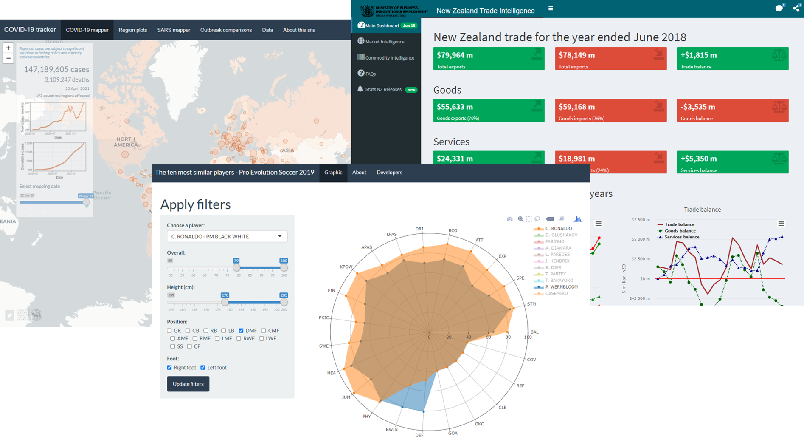
```
[Shiny Gallery](https://shiny.rstudio.com/gallery/)
</div>

## Getting started {.build}

### Installation

```{r eval=FALSE, echo=TRUE, include=TRUE}
install.packages("shiny")
library(shiny)
```

### Grundstruktur von Shiny apps

```{r, out.width = "80%", echo=F, fig.cap="Struktur von shiny apps", fig.align='center'}
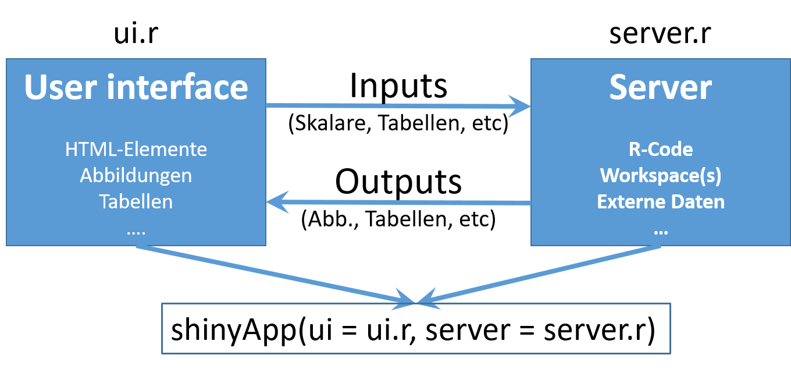
```

## Quellen & Hilfe

<font size="5">

- https://shiny.rstudio.com/
- https://shiny.rstudio.com/images/shiny-cheatsheet.pdf
- https://www.r-bloggers.com/2021/03/a-gentle-introduction-to-r-shiny/
- https://mastering-shiny.org/
- und vieles mehr ...

</font>

```{r, out.width = "80%", echo=F, fig.cap="Struktur von shiny apps", fig.align='center'}
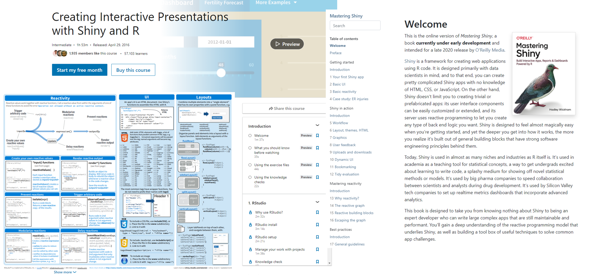
```
# Aufbau von Shiny Apps 

## Layouts

```{r, out.width = "85%", echo=F, fig.cap="Layout von Shiny apps (https://mastering-shiny.org/action-layout.html)", fig.align='center'}
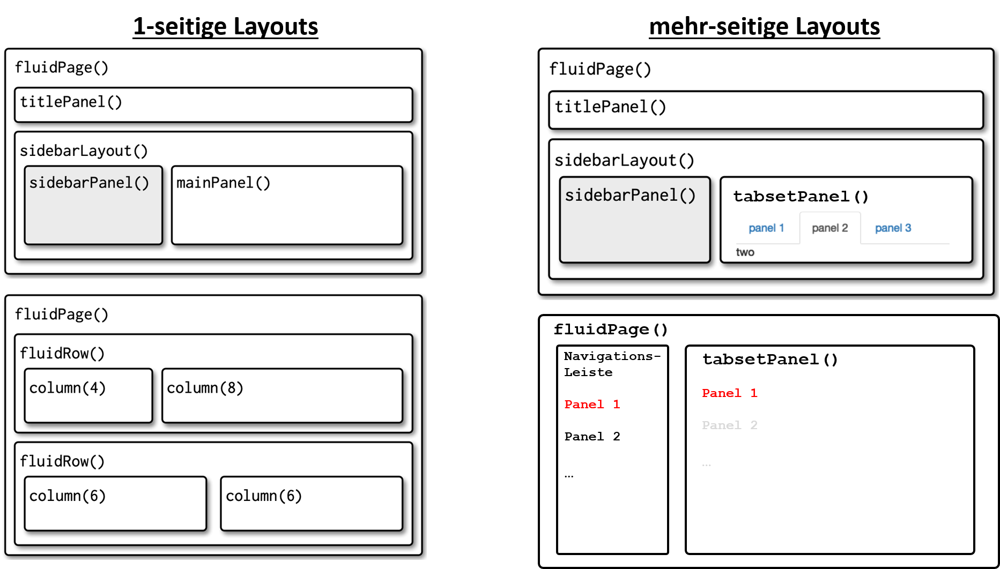
```


## Elemente in Server und UI {.build}

```{r, out.width = "55%", echo=F, fig.cap="Struktur von shiny apps", fig.align='center'}
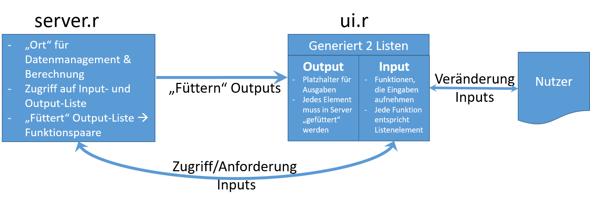
```

<div class="columns-2">

### Syntax Input-Elemente

UI-Input-Element: `<Typ>Input("<In-ID>", ...)` <-> Server-Zugriff: `input$<In-ID>`

+-------------------+-------------------+
| UI-Input-Element  | Output-Typ        |
+===================+===================+
| `textInput()`     | `character`       |
+-------------------+-------------------+
| `sliderInput()`   | `numeric`         |
+-------------------+-------------------+
| `numericInput()`  | `numeric`         |
+-------------------+-------------------+
| ...               | ...               |
+-------------------+-------------------+


### Syntax Output-Verbindung

UI-Output-Element: `<Typ>Output("<OutID>")` <-> Server-Partner: `output$<OutID> <- render<Typ>({<Code>})`

+-------------------+-------------------+
| UI-Output-Element | Server-Partner    |
+===================+===================+
| `textOutput()`    | `renderText()`    |
+-------------------+-------------------+
| `plotOutput()`    | `renderPlot()`    |
+-------------------+-------------------+
| `tableOutput()`   | `renderTable()`   |
+-------------------+-------------------+
| ...               | ...               |
+-------------------+-------------------+


</div>


# Reaktivität & Interaktivität

## Direkte Interaktion

> <font size="5.5">Standardmäßig wird ein Output-Element aktualisiert, wenn sich mindestens eines der verwendeten Input-Elemente ändert.</font>

```{r, out.width = "30%", echo=F, fig.cap="Direkte Interaktion", fig.align='center'}
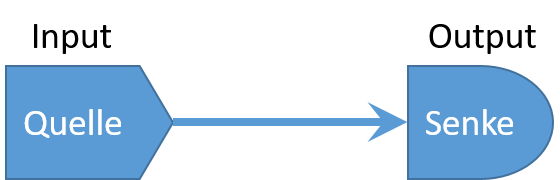
```

<div class="columns-2">
```{r, echo=TRUE}
inputPanel(
  sliderInput("nb.bins", label = "Number of bins:", 
              min = 1, max = 35, value = 20)
  )
```

<br>
<br>
<br>
<br>
<br>
<br>
<br>
<br>
<br>

```{r, echo=TRUE}
renderPlot({
  hist(faithful$eruptions, probability = TRUE, 
       breaks = as.numeric(input$nb.bins), 
       xlab = "Duration (minutes)", 
       main = "Histogram")
}, height = 250)
```

</div>

## Multiple Interaktionen

<div class="columns-2">

```{r, out.width = "60%", echo=F, fig.cap="Multiple Interaktion", fig.align='center'}
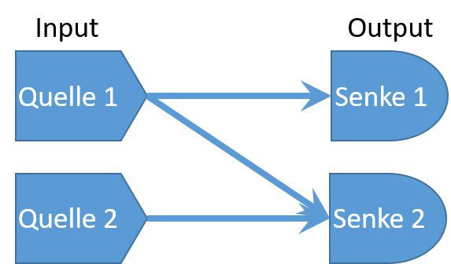
```

```{r, echo=TRUE}
inputPanel(
  sliderInput("nb.bins.2", label = "Number of bins:", 
              min = 1, max = 35, value = 20),
  sliderInput("bw.adjust.2", label = "Bandwidth adjustment:",
              min = 0.2, max = 2, value = 1, step = 0.2)
  )
```

<br>
<br>
<br>
<br>
<br>
<br>
<br>
<br>

```{r, echo=TRUE}
renderPlot({
  x    <- faithful$waiting
  bins <- seq(min(x), max(x), length.out = input$nb.bins.2 + 1)
  hist(x, breaks = bins, probability = TRUE, xlab = "Duration (minutes)", main = "Histogram")
  dens <- density(x, adjust = input$bw.adjust.2)
  lines(dens, col = "blue")
}, height = 200)

renderTable({
  x    <- faithful$waiting
  cnt <- binCounts(x = x, bx = seq(min(x), max(x), length.out = input$nb.bins.2 + 1))
  as.data.frame(matrix(cnt, nrow = 1))
})
```

</div>

## Verzögerte Interaktionen {.columns-2}

```{r, out.width = "80%", echo=F, fig.cap="Verzögerte Interaktion", fig.align='center'}
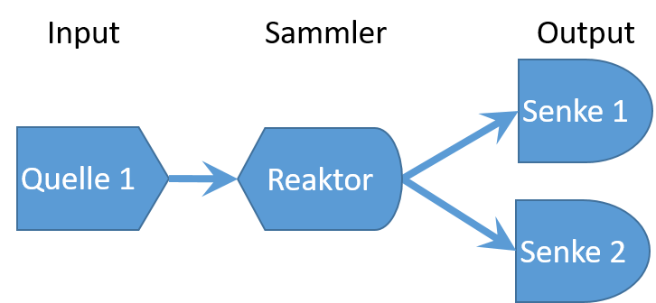
```

```{r, echo=TRUE}
inputPanel(
  sliderInput("nb.bins.3", label = "Number of bins:", 
              min = 1, max = 35, value = 20)
  )
```

<br>
<br>
<br>
<br>
<br>
<br>
<br>
<br>
<br>

```{r, echo=TRUE}
data.sum <- reactive({
  x    <- faithful$waiting
  bins <- seq(min(x), max(x), length.out = input$nb.bins.3 + 1)
  list(x = x, bins = bins)
})
renderPlot({
  hist(data.sum()$x, breaks = data.sum()$bins, probability = TRUE, xlab = "Duration (minutes)", main = "Histogram")
}, height = 200)

renderTable({
  cnt <- binCounts(x = data.sum()$x, bx = data.sum()$bins)
  as.data.frame(matrix(cnt, nrow = 1))
})
```


<!-- New chapter -->

## Konditionale Interaktionen {.columns-2 .build}

```{r, out.width = "50%", echo=F, fig.cap="Verzögerte Interaktion", fig.align='center'}
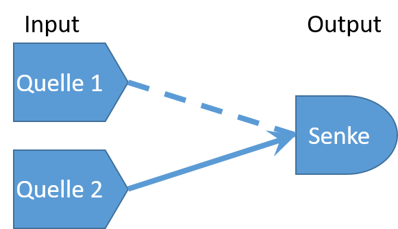
```

```{r, echo=TRUE}
inputPanel(
  sliderInput("nb.bins.4", label = "Number of bins:", 
              min = 1, max = 35, value = 20),
  actionButton("update.plot", "Update plot")
  )
```

<br>
<br>
<br>
<br>
<br>
<br>
<br>
<br>
<br>

```{r, echo=TRUE}
renderPlot({
  input$update.plot
  hist(faithful$waiting, breaks = input$nb.bins.4, probability = TRUE, 
       xlab = "Duration (minutes)", main = "Histogram")}, height = 150)
```

```{r, echo=TRUE}
renderPlot({
  input$update.plot
  isolate(hist(faithful$waiting, breaks = input$nb.bins.4, probability = TRUE, 
       xlab = "Duration (minutes)", main = "Histogram"))}, height = 150)
```

# Data Wrangling

## statisch-interaktives Datenmanagement {.build}

```{r, out.width = "50%", echo=F, fig.cap="Verzögerte Interaktion", fig.align='center'}
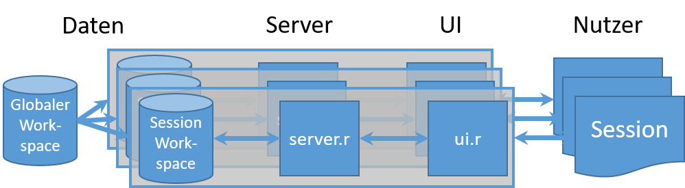
```

> - Standardfall: zentrale Datenbasis, inviduelle Auswertung/Darstellung
> - jeder Nutzer greift auf gleiche Informationen und Proceduren zu
> - bei jedem Nutzerzugriff wird ein `shinyApp()`-Instanz ausgeführt
> - daher: globaler Workspace und Funktionspool sinnvoll

<div class="columns-2">
Ineffizient:

```{r eval=FALSE, include=T, echo=TRUE}
library(shiny)
shinyServer(func = function(input, output) {
  bigDataSet <- read.csv('bigdata.csv')
  utilityFunction <- function(x) {# Function code here }
  # ...
})
```

<br>

Effizienter:

```{r eval=FALSE, include=T, echo=TRUE}
library(shiny)
bigDataSet <- read.csv('bigdata.csv')
utilityFunction <- function(x) {# Function code here }
shinyServer(func = function(input, output) {
  # ...
})
```
</div>

## statisch-reaktives Datenmanagement: globaler Workspace

```{r, out.width = "50%", echo=F, fig.cap="Verzögerte Interaktion", fig.align='center'}

```

<div class="columns-2">


```{r  echo=F}
x   <- faithful[, 2]
values <<- reactiveValues(y = 31)

ui <- fluidPage(
  sliderInput("nb.bins.5","Number of bins:", min = 1,max = 50, value = 30),
  plotOutput("distPlot", height = "200px", width = "400px")
  )

server <- function(input, output) {
    observe({
        values$y <<- input$nb.bins.5 + 1
    })
  observe({
    output$distPlot <- renderPlot({
        bins <- seq(min(x), max(x), length.out = values$y)
        hist(x, breaks = bins, probability = TRUE, xlab = "Duration (minutes)", main = "Histogram")
    })
  })
}
shinyApp(ui = ui, server = server, options = list(height = 250))
```

<br>

```{r  echo=TRUE, eval=FALSE}
x   <- faithful[, 2]
values <<- reactiveValues(y = 31)
ui <- fluidPage(
  sliderInput("nb.bins.6","Number of bins:", min = 1,max = 50, value = 30),
  plotOutput("distPlot")
  )
server <- function(input, output) {
    observe({ values$y <<- input$nb.bins.6 + 1 })
    output$distPlot <- renderPlot({
        bins <- seq(min(x), max(x), length.out = values$y)
        hist(x, breaks = bins, probability = TRUE, 
             xlab = "Duration (minutes)", main = "Histogram")
    })
}
shinyApp(ui = ui, server = server)
```

</div>

## dynamisches Datenmanagement: Auslagerungsdateien

```{r, out.width = "50%", echo=F, fig.cap="Verzögerte Interaktion", fig.align='center'}
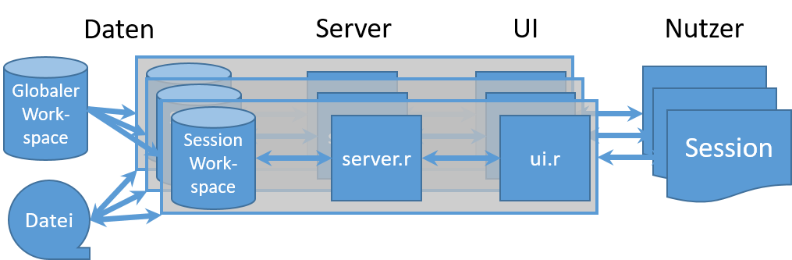
```

### Pro/Contra

> - Basisdaten können aus Dateien in initialen Workspace geladen werden -> sinnvoll für große Datenmengen
> - Auswertungen können in Dateien lokal abgespeichert werden 
> - Probleme: 
>    - Zugriffskonflikte bei mehreren Sessions -> Dateibenamung
>    - Dateien liegen auf Web-Server -> Zugriff?
> - Auswege: 
>    - Anbindung an externe Cloud-Speicher (z.B. Dropbox)
>    - Download der Daten
> - Veränderung von Basisdaten-Dateien ähnlich problematisch -> dynamische Datenbank

## Dynamisches DM: Datei-Up-/Download 

```{r  echo=T, eval=FALSE}
# initialize Covid data
tmp.dat <<- read.csv(url("https://raw.githubusercontent.com/CSSEGISandData/COVID-19/master/csse_covid_19_data/csse_covid_19_time_series/time_series_covid19_confirmed_global.csv"), header = T)
tmp.x   <<- tmp.dat[,ncol(tmp.dat)]
# part of server: update data using observe()
observe({ req(input$upload.data)
    tmp <- read.csv(input$upload.data$datapath, header = F)
    tmp.x <<- as.numeric(tmp[1,]) # select first row
  })
# part of server: download handler
  output$download.btn <- downloadHandler(
    filename = function()  "data.csv" ,
    content = function(file) write.csv(data.frame(matrix(tmp.x, ncol = 1)), file) ) 
```

```{r  echo=F, eval=TRUE}
tmp.dat <<- read.csv(url("https://raw.githubusercontent.com/CSSEGISandData/COVID-19/master/csse_covid_19_data/csse_covid_19_time_series/time_series_covid19_confirmed_global.csv"), header = T)
tmp.x   <<- tmp.dat[,ncol(tmp.dat)]

ui <- fluidPage( 
  sidebarLayout(
        sidebarPanel(
          sliderInput("nb.bins.7", label = "Number of bins:", 
              min = 1, max = 10, value = 6),
          fileInput("upload.data", "Upload new data"),
          downloadButton("download.btn","download data"),
          actionButton("show.data", "Show data")
        ),
   mainPanel( dataTableOutput("bin.data"))
  )
  )
  
server <- function(input, output) {
  observe({
    req(input$upload.data)
    file <- input$upload.data
    tmp <- read.csv(file$datapath, header = F)
    tmp.x <<- as.numeric(tmp[1,])
  })
  output$bin.data <- renderDataTable({
    input$show.data
    isolate(tmp.bins <- seq(min(tmp.x), max(tmp.x), length.out = input$nb.bins.7 + 1))
    cnt <- binCounts(x = tmp.x, bx = tmp.bins)
    data.frame(matrix(cnt, nrow = 1))
  })
output$download.btn <- downloadHandler(
  filename = function()  "data.csv" ,
  content = function(file) write.csv(data.frame(matrix(tmp.x, ncol = 1)), file)  
)  
}
shinyApp(ui = ui, server = server)
```

## Dynamisches DM: Handsontables {.build}

> Handsontables sind Java-Widgets, die in Shiny importiert werden können. Sie ermöglichen einfaches Datenmanagement über bearbeitbare Tabellen.

<br>

**Eigenschaften**:

> - Zugriff über Paket `library(rhandsontables)`
> - Handsontables sind Input & Outputobjekte zugleich
> - vielfältige Anpassungen zu Formatioerung, Wertebereiche, Hervorhebungen, etc.
> - Flexible: Einträge in Tabelle können verändert werden, Spalten und Zeilen können zugefügt werden
> - Copy & Paste z.B. aus Excel möglich
> - Informationen: https://jrowen.github.io/rhandsontable/


```{r, echo=FALSE}
nb <- 5
DF = data.frame(integer = 1:nb,
                   numeric = rnorm(nb),
                   logical = rep(TRUE, nb), 
                   character = LETTERS[1:nb],
                   factor = factor(letters[1:nb], levels = letters[nb:1], 
                                   ordered = TRUE),
                   factor_allow = factor(letters[1:nb], levels = letters[nb:1], 
                                         ordered = TRUE),
                   date = seq(from = Sys.Date(), by = "days", length.out = nb),
                   stringsAsFactors = FALSE)

rhandsontable(DF, width = 900, height = 200) %>%
  hot_col("factor_allow", allowInvalid = TRUE) %>% hot_cols(
    columnSorting = T, manualColumnMove = T, manualColumnResize = T
  )
```


## Beispiel Handsontables {.columns-2}

```{r echo = T}
inputPanel(
rHandsontableOutput("hot.data")
)
```

<br>
<br>
<br>
<br>
<br>
<br>
<br>
<br>

```{r, echo=T}
output$hot.data <- renderRHandsontable({
  dt.tab <- data.frame(
        group = sample(c("A","B"), 15, replace = T) , 
        values = rnorm(15) )
  rhandsontable(dt.tab, height = 400, selectCallback = TRUE, readOnly = FALSE)
    })
renderPlot({
   req(input$hot.data)
   boxplot(values ~ group, hot_to_r(input$hot.data))
  })

```

# Plotly & Leaflet

## Interaktive Abbildungen {.build}

<font size="5.5">
Plotly und Leaflet sind Java-Bibliotheken zur Generierung von HTML-Abbildungen. </font>

<font size="5.5">
Plotly.js ist speziell für die Visualisierung von Statistik- und ML-Analysen entwickelt. </font>

<font size="5.5">
Leaflet ist für die Darstellung von GIS-Daten entwickelt. 
</font>

<div class="columns-2">

<br>

<font size="5"> **Vorteile**</font>

- Hinzufügen von Hintergrundinformationen (Popups, Labels, etc.)
- interaktive Graphiken -> Anpassung an Nutzerwünsche (Zoom, Selektion etc.)
- ähnliche Syntax (Überlagerungslogik, Piping, etc.)
- Plotly: Konvertierung von GGplot zu Plotly einfach (`ggplotly()`)
- Leaflet: Support für eigene Kartenüberlagerung (GeoJSONs)

<br>
<br>
<br>
<br>
<br>
<br>
```{r, out.width = "102%", echo=F, fig.cap="Beispiel Plotly & Leaflet"}
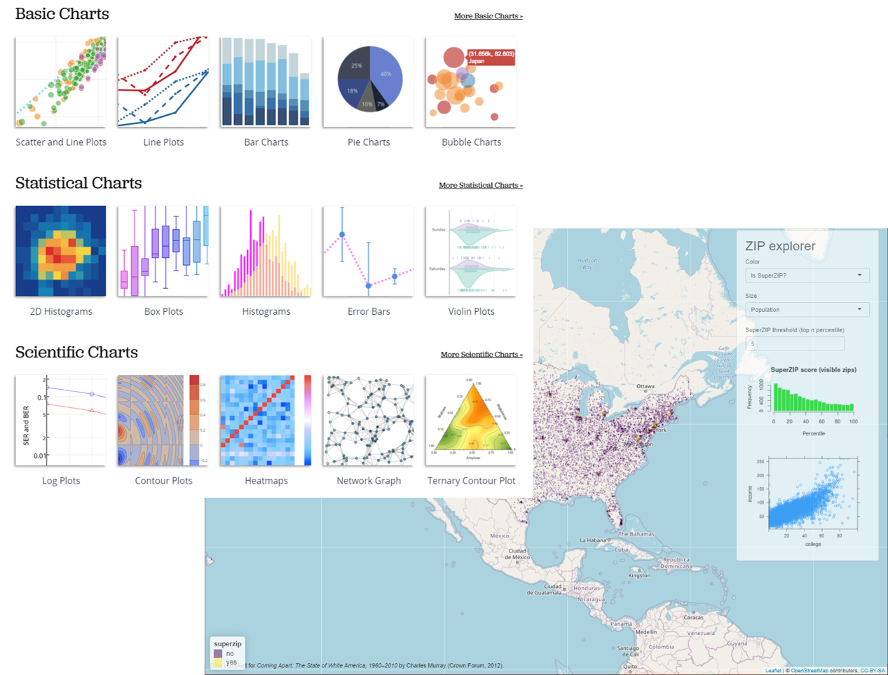
```
[Plotly](https://plotly.com/r/)  [Leaflet](https://rstudio.github.io/leaflet/) 
</div>

## Beispiel Plotly

```{r, echo=T, out.width="100%"}
dat.covid.long <- dat.covid.lk %>% pivot_longer(cols = 3:ncol(dat.covid.lk), names_to = "datum", values_to = "inzidenz") 
dat.covid.long <- dat.covid.long %>% add_column("land" = substr(dat.covid.long$LKNR,1,2))
dat.covid.long$datum <- dmy(dat.covid.long$datum)

dat.covid.long %>% 
  filter(LKNR %in% c("15088", "15002", "15084", "14713","14729","14730")) %>%
  plot_ly(x = ~datum) %>%
  add_lines(y=~inzidenz, color = ~LK)
```

## Beispiel Plotly via GGplot

```{r, echo=TRUE, out.width="100%", error=F, warning=F, message=F}
ggfig <- dat.covid.long %>% 
  filter(LKNR %in% c("15088", "15002", "15084", "14713","14729","14730")) %>%
 ggplot(aes(x=datum, y=inzidenz, col = LK) ) +
         geom_line() + geom_smooth()
ggplotly(ggfig)
```


## Projektbeispiel Plotly


## Beispiel Leaflet 

```{r, echo=T, out.width="99%", fig.height= 4.5}
pal.covid <- colorBin("YlOrRd", domain = de_map.add$inzidenz)
labels.covid <- sprintf("<strong>%s</strong><br/>%g",  md.map.add$LK, round(md.map.add$inzidenz,0) ) %>% lapply(HTML)
leaflet(md.map.add) %>% 
   addPolygons( weight = 2, fillOpacity = 1, color = "white",fillColor = ~pal.covid(inzidenz), label = labels.covid) %>%
   addLegend("topright", pal = pal.covid, values = ~inzidenz,
     title = "7-Tage-Inzidenz (pro Kreis)", opacity = 1)
```

## Projektbeispiel Leaflet

```{r, echo=FALSE, message=FALSE, warning=FALSE, out.width="100%",  fig.height= 5.5}
leaflet(middlemetrogermany) %>%
  addTiles(group = "OSM") %>%
  addPolygons(data = filter(middlemetrogermany, metropolregion == T) ,
              fillColor = pal(T) ,
              weight = 2,
              opacity = 1,
              color = "white",
              dashArray = "3",
              fillOpacity = 0.5,
              group = "Metropolregion") %>%
  addPolygons(data = middlemetrogermany ,
              fillColor = pal(F) ,
              weight = 2,
              opacity = 1,
              color = "white",
              dashArray = "3",
              fillOpacity = 0.5,
              group = "Mitteldeutschland") %>%
  addAwesomeMarkers(
    lat = coordlist.md$latitude,
    lng = coordlist.md$longitude,
    icon = icons,
    group = "Einrichtungen",
    label = coordlist.md$einrichtung
    ) %>%
  addLayersControl(
    overlayGroups = c("OSM", "Metropolregion", "Mitteldeutschland","Einrichtungen", "Verflechtungen"),
    options = layersControlOptions(collapsed = T)
  ) %>%
  addLegend(colors = pal(c(F,T)), labels = c("Mitteldeutschland","Metropolregion"), opacity = 0.7, title = NULL, position = "topright") %>%
  addLegend(colors = c("blue","orange","green"), labels = c("Industrie","Forschung","Hochschule"), opacity = 0.7, title = NULL, position = "topright") %>%
  addPolylines(data = edges.md.slines, color = "grey", weight = 2.5, opacity = .8, label = names(edges.md.slines), group = "Verflechtungen") %>%
  hideGroup("Verflechtungen") %>%
  hideGroup("OSM")
```

## Fazit

<font size="6"> 

- Shiny-Apps eignen sich zum "Erlebbarmachen" von Datenanalyse- und Prgrammierprojekten 
- Plotly und Leaflet eignen sich besonders zur Visualisierung komplexer Datensätze
- nur eingeschränkte Datenbank-Funktionalitäten 
- dafür aber volle Funktionalität von R
- Datenmanagement und Effizienz der Programmierung wichtig
- für breitere Anwendung ist Server-Architektur wichtig -> meist ist R limitierend
- Shiny-Apps oft gutes "Schaufenster" in Projektergebnisse

</font>

```{r, out.width = "20%", echo=F, fig.cap="Quelle: Wikipedia", fig.align="center"}

```
